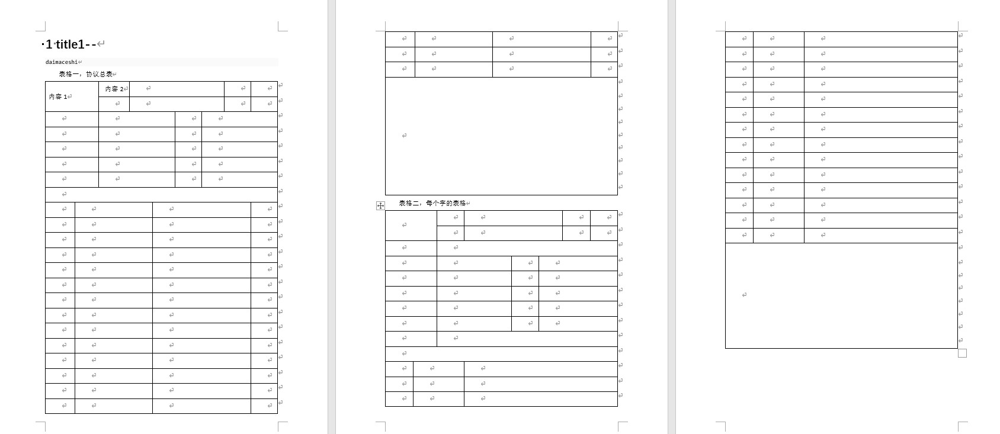
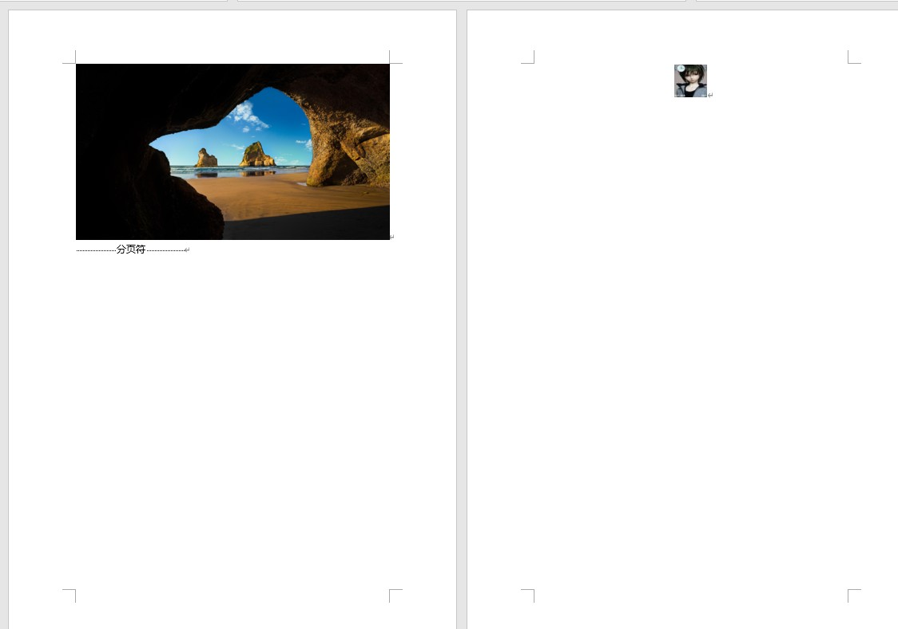

# 说明

为了Qt开发过程中实现导出word文档的功能，在[lpxxn/docx: qt office word lib (github.com)](https://github.com/lpxxn/docx)库的基础上进行了修改，以实现自己所需的功能。

# 在原有库的基础上进行了如下改动：

1. 修复创建的表格无边框线的问题，且默认表格宽度太小，设置为默认4cm；
2. 修复创建标题时仍然显示为正文样式的问题；
3. 增加了表格按照区域范围合并单元格的功能；
4. 实现向单元格添加文本时，设置对齐方式；
5. 实现添加图片时，默认居中对齐，去掉左侧的两个空格的缩进以及自适应图片大小。

# 使用方法

使用方法见main.cpp代码文件。示例效果如下图所示：

